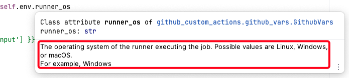

# github-custom-actions

Python package for creating [custom GitHub Actions](https://docs.github.com/en/actions/creating-actions/about-custom-actions). 

It works with Python 3.7 and up, so even those dusty old self-hosted action runners can handle it like champs.

### Quick start

```python
from github_custom_actions import ActionBase
    
class MyAction(ActionBase):
    def main(self):
        self.outputs["runner-os"] = self.vars.runner_os
        self.summary.text += (
            self.render(
                "### {{ inputs['my-input'] }}.\n"
                "Have a nice day!"
            )
        )

if __name__ == "__main__":
    MyAction().run()
```

This example uses the `runner_os` variable from GitHub environment variables. 
All variables from the GitHub environment are available in the `vars`, 
with descriptions shown in your IDE on mouse hover:


The action gets a value from the `my-input` action input and renders 
it in the action step summary on the GitHub build summary.

It also returns a value to the `runner-os` action output.

The main block runs the `main()` method of the action with the necessary boilerplate to catch and report exceptions.

### Explicitly defined inputs and outputs

With explicitly defined inputs and outputs, you can use typo-checked code autocompletion:

```python
from github_custom_actions import ActionBase, ActionInputs, ActionOutputs

class MyInputs(ActionInputs):
    my_input: str
    """My input description"""
    
    my_path: Path
    """My path description"""
    
    
class MyOutputs(ActionOutputs):
    runner_os: str
    """Runner OS description"""

    
class MyAction(ActionBase):
    
    inputs = MyInputs()
    outputs = MyOutputs()

    def main(self):
        if self.inputs.my_path is None:
            raise ValueError("my-path is required")
        self.inputs.my_path.mkdir(exist_ok=True)
        self.outputs.runner_os = self.vars.runner_os
        self.summary.text += (
            self.render(
                "### {{ inputs.my_input }}.\n"
                "Have a nice day!"
            )
        )

if __name__ == "__main__":
    MyAction().run()
```

Now you can utilize the attributes defined in the `inputs` and `outputs` classes of the action. 
All attributes names are converted to `kebab-case`, allowing dot notation like `inputs.my_input`
to replace the `inputs['my-input']`.

### Example of usage
[allure-report action](https://github.com/andgineer/allure-report)
